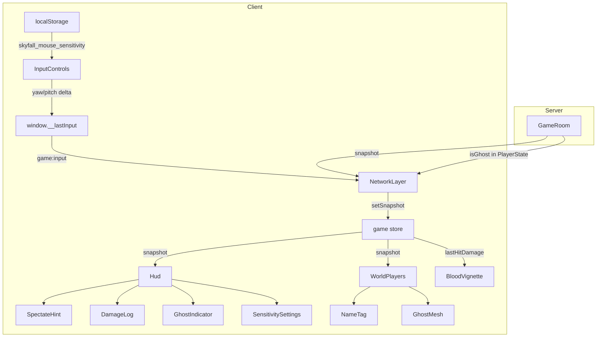
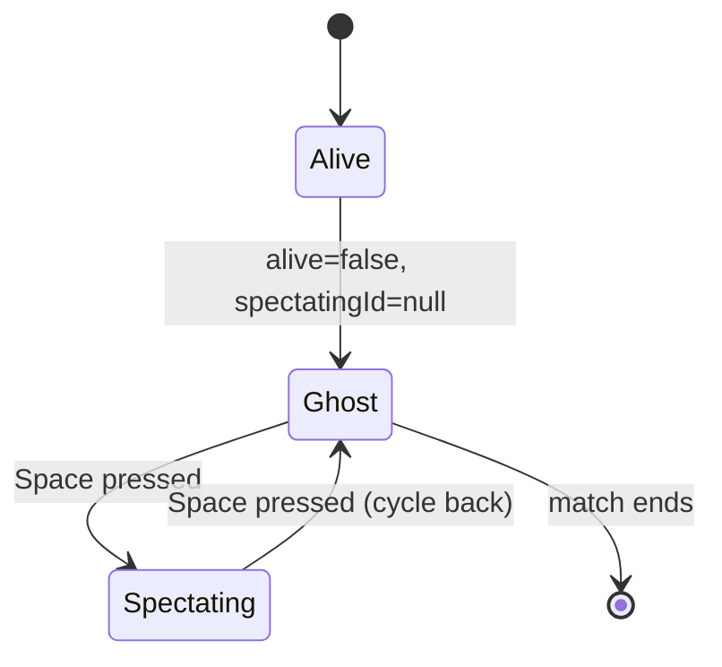

# Design Document — Game Enhancements

## Overview

ฟีเจอร์ชุดนี้เพิ่มประสบการณ์การเล่น Skyfall Royale ใน 8 ด้าน โดยทั้งหมดสร้างบนโครงสร้างที่มีอยู่แล้ว ได้แก่ React Three Fiber (client), Zustand stores, Socket.IO (transport), และ Node.js GameRoom (server)

ฟีเจอร์ทั้ง 8 แบ่งเป็น 3 กลุ่ม:

- **Client-only** (ไม่ต้องแก้ server): Mouse Sensitivity, Player NameTag, Team Color, Death Spectate Hint, Damage Dealt UI, Screen Blood Vignette
- **Client + Server** (ต้องแก้ทั้งสองฝั่ง): Ghost Mode After Death
- **Already implemented** (มีโครงสร้างแล้ว ต้องเชื่อมต่อ): Multiple Maps

---

## Architecture



### หลักการออกแบบ

1. **Zero new stores** — ใช้ Zustand stores ที่มีอยู่ (`game`, `session`, `combat`) เพิ่ม slice เล็กน้อยเท่าที่จำเป็น
2. **Ref-driven rendering** — WorldPlayers ใช้ `useFrame` + Three.js refs โดยตรง ไม่ผ่าน React re-render เพื่อ performance
3. **Protocol stability** — เพิ่ม `isGhost` field ใน `PlayerState` ทั้ง client และ server พร้อมกัน
4. **localStorage isolation** — sensitivity ใช้ key `skyfall_mouse_sensitivity` ไม่กระทบ key อื่น

---

## Components and Interfaces

### 1. Mouse Sensitivity Setting

**ไฟล์ที่แก้ไข:**
- `client/src/game/InputControls.tsx` — อ่าน sensitivity จาก localStorage และใช้คูณ delta
- `client/src/ui/Hud.tsx` — เพิ่ม settings button (⚙️) และ `SensitivityPanel` component

**Interface:**

```typescript
// ฟังก์ชัน utility สำหรับ sensitivity
function loadSensitivity(): number  // อ่านจาก localStorage, fallback 1.0
function saveSensitivity(v: number): void  // บันทึกลง localStorage

// SensitivityPanel props
interface SensitivityPanelProps {
  value: number           // ค่าปัจจุบัน [0.1, 5.0]
  onChange: (v: number) => void
}
```

**การคำนวณ delta:**
```
yaw   -= movementX * BASE_SENS * userSensitivity   // BASE_SENS = 0.0022
pitch -= movementY * BASE_SENS * userSensitivity
```

**localStorage key:** `skyfall_mouse_sensitivity`

---

### 2. Player NameTag Above Head

**ไฟล์ที่แก้ไข:**
- `client/src/game/WorldPlayers.tsx` — เพิ่ม `<Html>` billboard NameTag ใน `useFrame`

**ข้อกำหนดตำแหน่ง:**
- Head sphere center อยู่ที่ `y = 1.52` (จาก `buildPlayerObject`)
- NameTag offset: `+0.4` → แสดงที่ `y = 1.92` เหนือ root position
- ซ่อนเมื่อ distance > 80 units

**สีตาม relationship:**

| Condition | Color |
|-----------|-------|
| self | ไม่แสดง |
| teammate (duo/squad) | `#60a5fa` (blue-400) |
| enemy / solo mode | `#fb7185` (rose-400) |

**Implementation:** ใช้ `<Html>` จาก `@react-three/drei` ซึ่งมี billboard behavior built-in

---

### 3. Team Color — Blue for Teammates

**ไฟล์ที่แก้ไข:**
- `client/src/game/WorldPlayers.tsx` — เพิ่ม `matTeammate` material และ logic เลือก material ตาม teamId
- `client/src/ui/Hud.tsx` — แก้ `MinimapDots` ให้ใช้สีทีม

**Materials เพิ่มเติม:**
```typescript
const matTeammate = new THREE.MeshStandardMaterial({ color: '#3b82f6', roughness: 0.45 })
// matSelf (#5eead4) และ matOther (#fb7185) มีอยู่แล้ว
```

**Logic เลือก torso material:**
```typescript
function getTorsoMaterial(p: PlayerState, playerId: string, teamMode: TeamMode): THREE.Material {
  if (p.id === playerId) return matSelf
  if (teamMode !== 'solo' && p.teamId === myTeamId) return matTeammate
  return matOther
}
```

**Minimap dot color:**
```typescript
fill={isTeammate ? '#60a5fa' : '#fb7185'}
```

---

### 4. Multiple Maps

**สถานะปัจจุบัน:** โครงสร้างมีครบแล้ว — `MapId`, `MAPS`, `setActiveMap`, `getActiveMap`, `LobbyScreen` map selector, `GameRoom` mapId storage

**สิ่งที่ต้องเพิ่ม:**
- `client/src/ui/WaitingRoom.tsx` — แสดง `nameTH` และ `descTH` ของแมพปัจจุบัน
- `client/src/net/NetworkLayer.tsx` — ตรวจสอบว่า `setActiveMap` ถูกเรียกเมื่อ `match:start` (มีอยู่แล้ว แต่ต้องยืนยัน)

**Data flow:**
```
Host เลือก mapId → room:create → Server เก็บ mapId → room:update broadcast
→ Client อ่าน room.mapId → match:start → setActiveMap(mapId) → GameScene re-renders
```

---

### 5. Death Spectate Hint

**ไฟล์ที่แก้ไข:**
- `client/src/ui/Hud.tsx` — แทนที่ overlay "คุณถูกกำจัด" ที่มีอยู่ด้วย `SpectateHint` component ที่ชัดเจนขึ้น

**Logic:**
```typescript
// แสดง SpectateHint เมื่อ:
const showHint = me && !me.alive && snapshot.remaining > 0

// ข้อความตาม spectatingId:
const hintText = me.spectatingId
  ? 'กด [Space] เพื่อเปลี่ยนเป้าหมาย'
  : 'กด [Space] เพื่อดูผู้เล่นอื่น'
```

**หมายเหตุ:** overlay "คุณถูกกำจัด" ที่มีอยู่ใน Hud.tsx จะถูก refactor เป็น `SpectateHint` component ที่มี styling ชัดเจนขึ้น

---

### 6. Damage Dealt UI / Hit Log Panel

**ไฟล์ที่แก้ไข:**
- `client/src/store/game.ts` — เพิ่ม `hitLog` slice
- `client/src/net/NetworkLayer.tsx` — populate `hitLog` จาก `damageNumbers` ใน snapshot
- `client/src/ui/Hud.tsx` — เพิ่ม `DamageLogPanel` component

**HitLog entry type:**
```typescript
interface HitLogEntry {
  targetId: string
  targetUsername: string
  damage: number
  isHead: boolean
  at: number
}
```

**Zustand slice เพิ่มใน game store:**
```typescript
hitLog: HitLogEntry[]
appendHit: (entry: HitLogEntry) => void
resetHitLog: () => void
```

**Logic populate hitLog** (ใน NetworkLayer `onState`):
```typescript
// damageNumbers ใน snapshot มี ownerId ไม่ได้ระบุ — ต้องใช้ fx:hitmarker event แทน
// หรือเพิ่ม shooterId ใน DamageNumber type
```

> **Design decision:** `DamageNumber` ใน protocol ปัจจุบันไม่มี `shooterId` — ต้องเพิ่ม field นี้ใน `DamageNumber` interface ทั้ง client และ server เพื่อให้ client รู้ว่า hit ไหนมาจากตัวเอง

**DamageNumber interface เพิ่ม:**
```typescript
interface DamageNumber {
  id: string; x: number; y: number; z: number
  damage: number; head: boolean; at: number
  shooterId: string    // NEW: ผู้ยิง
  targetId: string     // NEW: เป้าหมาย
  targetUsername: string  // NEW: ชื่อเป้าหมาย
}
```

**Body Silhouette SVG** — inline SVG แสดง front-view human silhouette พร้อม hit markers:
- Head zone: วงกลมบนสุด
- Body zone: สี่เหลี่ยมกลาง
- Hit markers: `●` สีอำพัน (head) หรือสีแดง (body)

---

### 7. Screen Blood Vignette Effect

**ไฟล์ที่แก้ไข:**
- `client/src/ui/Hud.tsx` — เพิ่ม `BloodVignette` component

**Component:**
```typescript
function BloodVignette({ hp, lastHit }: {
  hp: number
  lastHit: { damage: number; at: number } | null
}) {
  // hit flash: fade จาก peak opacity ใน 600ms
  // low-health persistent: opacity 0.20 เมื่อ hp < 30
}
```

**Opacity mapping:**
```typescript
function hitOpacity(damage: number): number {
  if (damage >= 50) return 0.85
  if (damage >= 20) return 0.55
  return 0.30
}
```

**CSS gradient:**
```css
background: radial-gradient(
  ellipse at center,
  transparent 40%,
  rgba(180, 0, 0, {opacity}) 100%
)
```

**State:** ใช้ `useRef` สำหรับ animation timestamp แทน `useState` เพื่อหลีกเลี่ยง re-render

---

### 8. Ghost Mode After Death

**ไฟล์ที่แก้ไข:**
- `server/src/types.ts` — เพิ่ม `isGhost` ใน `PlayerState`
- `client/src/types/protocol.ts` — เพิ่ม `isGhost` ใน `PlayerState`
- `server/src/GameRoom.ts` — broadcast ghost position ใน snapshot, handle ghost input
- `client/src/game/InputControls.tsx` — ghost movement mode
- `client/src/game/ThirdPersonCamera.tsx` — ghost free-fly camera
- `client/src/game/WorldPlayers.tsx` — render ghost mesh
- `client/src/ui/Hud.tsx` — ghost indicator

**Ghost state machine:**


**Ghost movement (client-side only):**
```typescript
// ใน InputControls ghost mode:
const GHOST_SPEED = 20  // units/sec
// WASD = horizontal, Space = up, Shift = down
// ไม่ส่ง game:input ไปยัง server
// อัปเดต ghostPosition ref โดยตรง
```

**Ghost camera (ThirdPersonCamera):**
```typescript
// เมื่อ ghost mode: first-person free-fly
// camera.position = ghostPosition + eye offset
// camera.lookAt = ghostPosition + forward * 80
```

**Ghost rendering (WorldPlayers):**
```typescript
const matGhost = new THREE.MeshStandardMaterial({
  color: '#9ca3af',
  transparent: true,
  opacity: 0.35,
})
// castShadow = false สำหรับ ghost mesh
```

**Server changes:**
- เพิ่ม `isGhost: boolean` ใน `InternalPlayer` และ `PlayerState`
- เมื่อ player ตาย: set `isGhost = true` (ถ้าไม่ได้ spectate)
- รับ `game:ghostMove` event จาก client เพื่ออัปเดต ghost position
- broadcast ghost position ใน snapshot เหมือน alive player (แต่ `alive = false`, `isGhost = true`)

**Protocol เพิ่ม:**
```typescript
// Client → Server
socket.emit('game:ghostMove', { x, y, z, yaw, pitch })

// Server → Client (ใน snapshot, PlayerState)
isGhost: boolean  // NEW field
```

---

## Data Models

### PlayerState (เพิ่ม field)

```typescript
interface PlayerState {
  // ... existing fields ...
  isGhost: boolean   // NEW: true เมื่อ dead + ghost mode
}
```

### DamageNumber (เพิ่ม fields)

```typescript
interface DamageNumber {
  id: string; x: number; y: number; z: number
  damage: number; head: boolean; at: number
  shooterId: string       // NEW
  targetId: string        // NEW
  targetUsername: string  // NEW
}
```

### HitLogEntry (ใหม่ใน client game store)

```typescript
interface HitLogEntry {
  targetId: string
  targetUsername: string
  damage: number
  isHead: boolean
  at: number
}
```

### localStorage Schema

```
key: "skyfall_mouse_sensitivity"
value: string (number ใน range [0.1, 5.0])
```

### Zustand game store additions

```typescript
// เพิ่มใน GameSlice
hitLog: HitLogEntry[]
appendHit: (entry: HitLogEntry) => void
resetHitLog: () => void
ghostPosition: { x: number; y: number; z: number; yaw: number; pitch: number } | null
setGhostPosition: (pos: ...) => void
```

---

## Correctness Properties

*A property is a characteristic or behavior that should hold true across all valid executions of a system — essentially, a formal statement about what the system should do. Properties serve as the bridge between human-readable specifications and machine-verifiable correctness guarantees.*

### Property 1: Sensitivity clamping

*For any* numeric value stored in or provided to the sensitivity loader, the resulting sensitivity value used by InputControls SHALL always be within the range [0.1, 5.0].

**Validates: Requirements 1.1, 1.4**

---

### Property 2: Sensitivity delta computation

*For any* user sensitivity value `s` in [0.1, 5.0] and any mouse movement `dx` pixels, the resulting yaw delta SHALL equal `dx × 0.0022 × s`.

**Validates: Requirements 1.2, 1.7**

---

### Property 3: Sensitivity localStorage round-trip

*For any* valid sensitivity value `s` in [0.1, 5.0], saving `s` to localStorage then loading it back SHALL return a value equal to `s`.

**Validates: Requirements 1.3**

---

### Property 4: NameTag visibility by distance

*For any* pair of player positions, the NameTag for the other player SHALL be visible if and only if the Euclidean distance between them is ≤ 80 units.

**Validates: Requirements 2.3**

---

### Property 5: NameTag color by relationship

*For any* snapshot and any non-self player, the NameTag color SHALL be `#60a5fa` if the player is a teammate (same teamId, teamMode ≠ solo), and `#fb7185` otherwise. The local player's own NameTag SHALL NOT be rendered.

**Validates: Requirements 2.4, 2.5, 2.6, 2.8**

---

### Property 6: Torso material color by relationship

*For any* snapshot and any player, the torso mesh material color SHALL be `#5eead4` for self, `#3b82f6` for teammates (teamMode ≠ solo), and `#fb7185` for all others.

**Validates: Requirements 3.1, 3.2, 3.3**

---

### Property 7: Minimap dot color by relationship

*For any* snapshot in duo or squad teamMode, each player dot on the minimap SHALL be colored `#60a5fa` if the player is a teammate and `#fb7185` if an enemy.

**Validates: Requirements 3.5**

---

### Property 8: Map registry completeness

*For any* MapId in `['island', 'desert', 'snow', 'city']`, `getMap(id)` SHALL return a `MapDef` with non-null `terrainHeight`, `skyColor`, `fogColor`, `nameTH`, and `descTH`.

**Validates: Requirements 4.1**

---

### Property 9: Map round-trip via setActiveMap

*For any* valid MapId `id`, calling `setActiveMap(id)` then `getActiveMap()` SHALL return the `MapDef` whose `id` field equals `id`.

**Validates: Requirements 4.3, 4.5**

---

### Property 10: WaitingRoom displays correct map info

*For any* mapId, the WaitingRoom component rendered with that mapId SHALL contain the string `MAPS[mapId].nameTH` and `MAPS[mapId].descTH` in its output.

**Validates: Requirements 4.4**

---

### Property 11: SpectateHint visibility

*For any* player state where `alive === false` and `remaining > 0`, the SpectateHint SHALL be rendered. When `remaining === 0`, the SpectateHint SHALL NOT be rendered.

**Validates: Requirements 5.1, 5.4, 5.5**

---

### Property 12: SpectateHint text by spectatingId

*For any* dead player state, the SpectateHint text SHALL be "กด [Space] เพื่อเปลี่ยนเป้าหมาย" when `spectatingId` is non-null, and "กด [Space] เพื่อดูผู้เล่นอื่น" when `spectatingId` is null.

**Validates: Requirements 5.2, 5.3**

---

### Property 13: DamageLog panel visibility

*For any* player state where `alive === false`, the DamageLog panel SHALL be rendered on the right side of the screen.

**Validates: Requirements 6.1**

---

### Property 14: DamageLog total damage display

*For any* player state, the DamageLog panel SHALL display a number equal to `me.damageDealt` as the total damage value.

**Validates: Requirements 6.3**

---

### Property 15: HitLog aggregation correctness

*For any* sequence of HitLogEntry records, the DamageLog panel SHALL display exactly one row per unique `targetId`, with the hit count equal to the number of entries for that target and the damage sum equal to the sum of `damage` fields for that target.

**Validates: Requirements 6.4, 6.5**

---

### Property 16: Hit marker color by zone

*For any* HitLogEntry, the rendered hit marker in the body silhouette SHALL use color `#f59e0b` (amber) when `isHead === true` and `#ef4444` (red) when `isHead === false`.

**Validates: Requirements 6.8**

---

### Property 17: Vignette opacity mapping

*For any* damage value `d`, the function `hitOpacity(d)` SHALL return 0.85 when `d ≥ 50`, 0.55 when `20 ≤ d < 50`, and 0.30 when `d < 20`.

**Validates: Requirements 7.3**

---

### Property 18: Low-health persistent vignette

*For any* player state, the persistent low-health vignette SHALL be visible at opacity 0.20 when `hp < 30`, and SHALL NOT be visible when `hp ≥ 30`.

**Validates: Requirements 7.7**

---

### Property 19: Ghost mode activation condition

*For any* player state where `alive === false` and `spectatingId === null`, ghost mode SHALL be active. When `spectatingId` is non-null, ghost mode SHALL be inactive.

**Validates: Requirements 8.1, 8.9**

---

### Property 20: Ghost mesh rendering

*For any* player in the snapshot where `isGhost === true`, the rendered mesh SHALL have material color `#9ca3af`, opacity `0.35`, and `castShadow === false`.

**Validates: Requirements 8.4, 8.7**

---

### Property 21: Ghost HUD indicator

*For any* local player state where ghost mode is active, the HUD SHALL display the "โหมดผี 👻" indicator. When ghost mode is inactive, the indicator SHALL NOT be displayed.

**Validates: Requirements 8.8**

---

## Error Handling

### Sensitivity

- ค่าที่ไม่ใช่ตัวเลข (NaN, null, undefined) จาก localStorage → fallback 1.0
- ค่านอกช่วง [0.1, 5.0] → clamp ไปที่ขอบเขต
- localStorage ไม่พร้อมใช้งาน (private browsing บางกรณี) → ใช้ default 1.0 และ catch exception

### Ghost Mode

- `game:ghostMove` ที่มาจาก player ที่ยังมีชีวิต → server ละเว้น (validate `alive === false`)
- Ghost position นอกขอบแมพ → server clamp ด้วย `clampToMap`
- Client ส่ง ghost move เร็วเกินไป → rate limit เหมือน `game:input` (ใช้ window ที่มีอยู่)

### DamageNumber / HitLog

- `shooterId` ไม่ตรงกับ player ใดใน snapshot → ละเว้น entry นั้น
- `targetUsername` ว่าง → แสดง "Unknown"
- hitLog ขนาดใหญ่เกิน → cap ที่ 200 entries เพื่อป้องกัน memory leak

### Map switching

- `mapId` ที่ไม่รู้จัก → `getMap()` fallback ไปที่ `island`
- `setActiveMap` ถูกเรียกก่อน GameScene mount → ไม่มีปัญหา เพราะ `getActiveMap()` อ่านค่าจาก module-level variable

---

## Testing Strategy

### Unit Tests (Vitest)

ทดสอบ pure functions และ logic ที่แยกออกมาได้:

- `loadSensitivity()` / `saveSensitivity()` — localStorage round-trip, fallback behavior
- `hitOpacity(damage)` — opacity mapping function
- `getTorsoMaterial(player, selfId, teamMode)` — material selection logic
- `getNameTagColor(player, selfId, teamMode)` — color selection logic
- `aggregateHitLog(entries)` — per-enemy aggregation
- `getMap(id)` — map registry completeness

### Property-Based Tests (fast-check)

ใช้ [fast-check](https://github.com/dubzzz/fast-check) สำหรับ property tests ทั้งหมด ตั้งค่า minimum 100 iterations ต่อ property

**Property tests ที่ต้องเขียน:**

| Property | Tag |
|----------|-----|
| Sensitivity clamping | Feature: game-enhancements, Property 1 |
| Sensitivity delta computation | Feature: game-enhancements, Property 2 |
| Sensitivity localStorage round-trip | Feature: game-enhancements, Property 3 |
| NameTag visibility by distance | Feature: game-enhancements, Property 4 |
| NameTag color by relationship | Feature: game-enhancements, Property 5 |
| Torso material color by relationship | Feature: game-enhancements, Property 6 |
| Minimap dot color by relationship | Feature: game-enhancements, Property 7 |
| Map registry completeness | Feature: game-enhancements, Property 8 |
| Map round-trip via setActiveMap | Feature: game-enhancements, Property 9 |
| WaitingRoom displays correct map info | Feature: game-enhancements, Property 10 |
| SpectateHint visibility | Feature: game-enhancements, Property 11 |
| SpectateHint text by spectatingId | Feature: game-enhancements, Property 12 |
| DamageLog panel visibility | Feature: game-enhancements, Property 13 |
| DamageLog total damage display | Feature: game-enhancements, Property 14 |
| HitLog aggregation correctness | Feature: game-enhancements, Property 15 |
| Hit marker color by zone | Feature: game-enhancements, Property 16 |
| Vignette opacity mapping | Feature: game-enhancements, Property 17 |
| Low-health persistent vignette | Feature: game-enhancements, Property 18 |
| Ghost mode activation condition | Feature: game-enhancements, Property 19 |
| Ghost mesh rendering | Feature: game-enhancements, Property 20 |
| Ghost HUD indicator | Feature: game-enhancements, Property 21 |

### Integration Tests

- Ghost position broadcast: ตรวจสอบว่า snapshot มี ghost player ที่ `isGhost=true` หลังจาก player ตาย
- Map selection broadcast: ตรวจสอบว่า `room:update` มี `mapId` ที่ถูกต้องหลัง host เลือกแมพ
- DamageNumber shooterId: ตรวจสอบว่า server ส่ง `shooterId` ใน `damageNumbers`

### Example Tests

- Settings button (⚙️) ปรากฏใน HUD ระหว่างเล่น
- SpectateHint แสดงข้อความ "กด [Space] เพื่อดูผู้เล่นอื่น" เมื่อ player ตาย
- DamageLog แสดง SVG silhouette พร้อม hit markers
- Ghost mesh มี `castShadow = false`
- Vignette มี `pointer-events: none`
